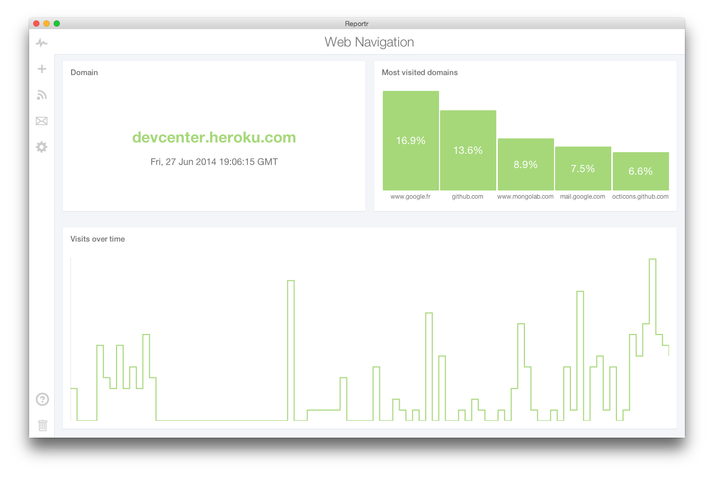

Reportr
=========

> "Your life's personal dashboard."

Reportr is a complete application which works like a dashboard for tracking events in your life (using a very simple API). With a simple interface, it helps you track and display your online activity or your real-life activity (with hardware trackers or applications like Runkeeper), some trackers are available on this organization.

The project is entirely open source and you can host your own Reportr instance on your own server or Heroku.

[](./preview.png)

## Start your instance

Reportr is really easy to run locally or on heroku-compatible services.

```
$ git clone https://github.com/Reportr/dashboard.git
$ npm install .
```

To run it locally (configuration can be stored in a .env file):

```
$ foreman start
```

To deploy it on Heroku:

```
$ heroku config:set MONGODB_URL=mongodb://...
$ heroku config:set AUTH_USERNAME=...
$ heroku config:set AUTH_PASSWORD=...
$ git push heroku master
```

## API and Events

Reportr uses an HTTP REST API to track events. Datas are always JSON encoded.

| Endpoint | HTTP Method | Description | Arguments |
| -------- | ----------- | ----------- | --------- |
| /api/infos | GET | Get informations about this instance |  |
| /api/types | GET | Return all event types |  |
| /api/events | POST | Post a new event | `<string>type`, `<object>properties` |
| /api/events | GET | List all events | `<string>type`, `<int>start(0)`, `<int>limit` |
| /api/stats/categories | GET | Get categorized events stats | `<string>type`,`<string>field` |
| /api/stats/time | GET | Get time stats | `<string>type`,`<string>fields`, `<string>interval`, `<string>func` |
| /api/reports | POST | Create a new report | `<string>title` |
| /api/reports | GET | List all reports |  |
| /api/report/:id | PUT | Update a report | `<string>title`, `<array>visualizations` |
| /api/report/:id | DELETE | Remove a report |  |
| /api/alerts | GET | List all alerts |  |
| /api/alerts | POST | Create an alert | `<string>type`, `<string>eventName`, `<string>condition`, `<string>title` |

## Configuration

Reportr is configured using environment variables.

| Name | Description |
| ---- | ----------- |
| PORT | Port for running the application, default is 5000 |
| MONGODB_URL | Url for the mongoDB database |
| AUTH_USERNAME | Username for authentication |
| AUTH_PASSWORD | Password for authentication |

## Concepts

* **Event**: an event represent something to monitor at a defined date. For example if I'm monitoring the temperature in my home, I'll post an event `home.temperature` with a property `temp`:

```
$ curl -X POST --data '{ "type":"home.temperature", "properties": { "temperature": 66 } }' http://localhost:5000/api/events
```

* **Report**: a report is a collection of event visualizations, it groups in the dashboard visualizations that are related, for example: I can have 2 reports: "My Home Activity" and "My GitHub Activity"
* **Visualization**: a visualization is a configured way to show data, for example in a pie, bar chart or time graph.
* **Alert**: an alert represent a way to send notifications for specific events (by email, sms, webhook, ...)

## Alerts

Reportr lets you configure alerts to be triggered when specific condition is valid at a specific interval.

#### Types

| Type | Description |
| ---- | ----------- |
| webhook | Post an HTTP request to a specific url with the data encoded in the body |

#### Condition

Condition for alerts are really easy to write, for example: `COUNT > 9`, this condition will be valid if at least 10 events have been posted in the alert interval. Conditions can also use the event object, for example: `event.temperature > 80`.
